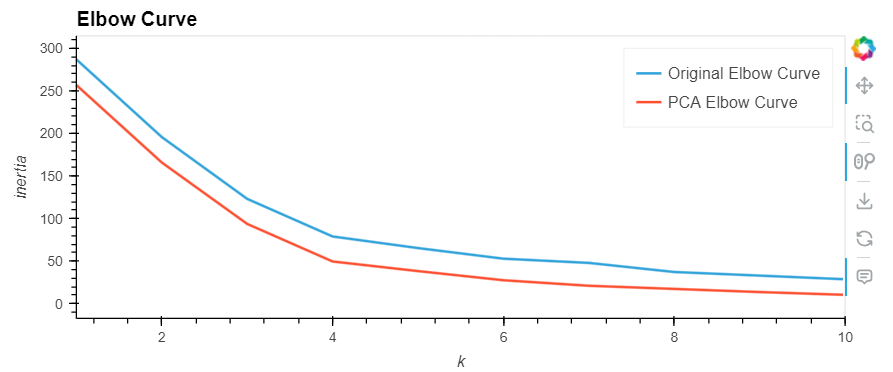
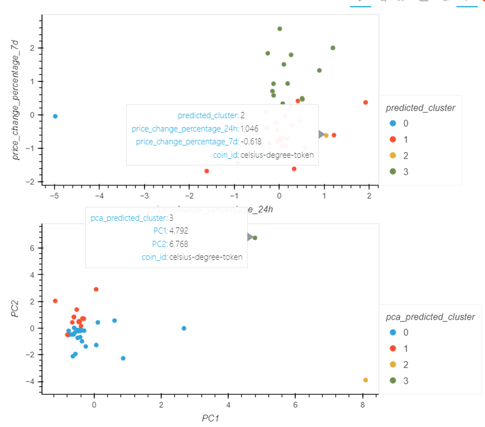
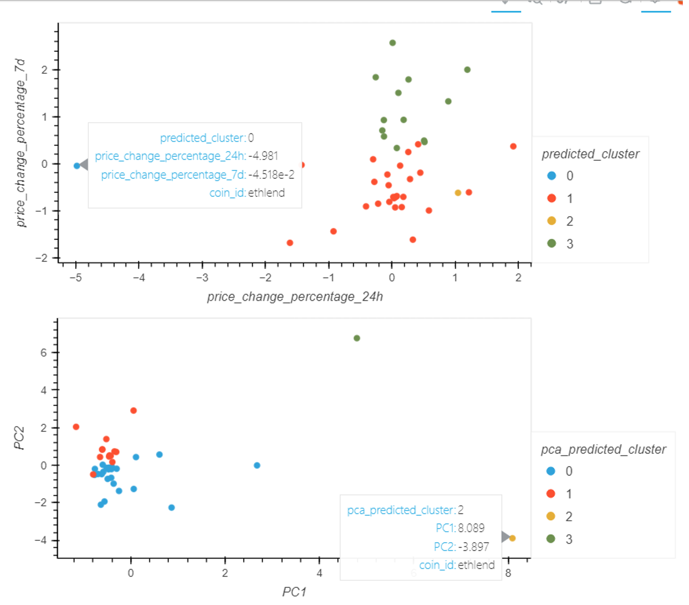

# CryptoClustering
Use Python and unsupervised learning to predict if cryptocurrencies are affected by 24-hour or 7-day price changes.

# Features
* Use Sci-Kit Learn's StandardScaler function to normalize the data (all 7 features)
* Using all 7 data features:
    * determine the best number of prediction clusters
    * plot the prediction clusters
* Use Principal Companent Analysis (Sci-Kit Learn PCA module specifically) to reduce the features to the top 3 and:
    * determine the best number of prediction clusters
    * plot the prediction clusters

# Results
Looking at the elbow curve from both methods, four (4) clusters are the optimal breakdown of the provided cryptocurrencies:

The PCA method clusters the data points more tightly clarifying connections within clusters. However, both methods split this dataset in the same way. As you can see below the two outlier groups are the same. Additionally, the members of group 3 of the original data aligns with the members of group 1 in the pca reduction.

celsius-degree-token | ethlen
:-------------------------:|:-------------------------:
  |  

# File Notes
* Crypto_Clustering.ipynb contains all the code to complete the requirements of this assignment.
* The Resources folder contains the data provided by edX for this assignment.
* The images folder contains screenshots of the results within the jupyter notebook.

# References
* Starting .ipynb file downloaded from BCS Project 19 Module
* Data file in the Resources folder from BC Project 19 Module. Data for this dataset was generated by edX Boot Camps LLC, and is intended for educational purposes only.
 

# Getting Started

## Prerequisites
You must have an environemtn with Python, pandas, hvplot, scikit-learn, jupyter notebook to run the provided notebook.

NOTE: You may experience warnings about memory leaks regarding Sci-Kit Learn

## Cloning Repo
$ git clone https://github.com/vt-bekah/CryptoClustering.git

$ cd CryptoClustering

$ jupyter lab

# Built With
* Python v3.10.11
* jupyter notebook v6.5.2
* jupyterlab v3.6.3
* conda v23.5.0
* scikit-learn v1.2.2

**Python Modules**
* pandas v1.5.3
* hvplot v0.8.4
